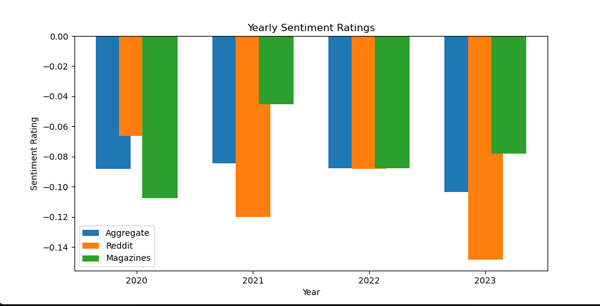

# Work from Home (WFH) Sentiment Analysis

I created & developed this project alongside three classmates (Johnny Boustany, Nick Petrocelli, David Lauerman) for my Spring 2023 Data Science course. 

The prevalence of remote work has increased substantially since the start of the COVID-19 pandemic in 2020, and as a result many articles have been written about it across a variety of sources. We investigated how the sentiments in these writings compare both across sources and time. Initially, many businesses began to accommodate work-from-home policies in order to comply with social distancing guidelines. However, as of late, many companies have been advocating for return to office employment schemes, despite pushback from their employees. Therefore, we wanted to analyze a diverse set of opinions to see if this was actually true – is remote work really on the decline, or is it here to stay? 

*The interactive D3.js web app is live here: https://max-dekle.github.io/wfh-sentiment-analysis/*

The application allows you to see all the 1,150 data points and click on the article/post associated with each data point.
Find a preview of the app below:

    

## Table of Contents
* [Technologies Used](#technologies-used)
* [General Info](#general-info)
* [Data and Methodology](#data-and-methodology)
* [Analysis](#analysis)
* [Project Status](#project-status)
* [Conclusion](#conclusion)
* [Challenges](#challenges)
* [Contributions](#contributions)
<!-- * [License](#license) -->

## Technologies Used
Python, Pandas, scikit-learn, D3.js

## General Info

Given a diverse set of voices and datapoints regarding remote work, we set out to test the hypothesis that remote work sentiment has decreased over the past few years post-Covid. We combined 3 unique sources for our dataset: The Guardian, The New York Times, and Reddit. 307 and 295 articles were obtained from the NYT and the Guardian, respectively, by querying their APIs for articles about ‘remote work’. 548 Reddit posts were obtained by scraping the “experienceddevs” and “cscareerquestions” subreddits for posts containing the terms “remote work”, “work from home”, or “WFH”. We used a supervised ML model with 71% accuracy to generate sentiment ratings that range from -1 (negative sentiment) to 1 (positive sentiment) for all our data points. Additionally, we hypothesized that social media and news sites would diverge from each other in their average sentiment while remaining consistent within the same category.

### Data and Methodology

We wanted to include a diverse array of perspectives in our data from both ordinary office workers and from mainstream news articles, which often capture the perspectives of managers and other officials. To do this, we obtained 1150 posts and articles in total, of which 307 were from the New York Times, 295 were from The Guardian, and 548 were from the Reddit communities /r/cscareerquestions and /r/experienceddevs.

We created  a sentiment score for each article using a ROBERTA-Base model fine-tuned for sentiment analysis of tweets1.  The scores were the average per-sentence sentiment of each given article scaled by the model’s confidence in its predictions. Thus, a score of 1.0 would be given to an extremely positive article, and likewise -1.0 would represent extremely negative sentiment. We found that this was a sufficient means of labeling sentiment, with manual validation showing agreement with human reviewers about 84% of the time, albeit with a bias towards rating news articles more neutrally.

## Analysis

To test our hypotheses, we performed three two-sample t-tests, two of which compared the average sentiment within each category of data source (news vs. Reddit) and one compared the average sentiment between the two categories. In all three cases, we failed to reject the null hypothesis, meaning that we did not find a statistically significant difference between the average sentiment between or within categories. 
To investigate the overall trend of sentiment further, we also trained a linear regression model to look for an upward or downward trend. While the model had a high accuracy with a low MSE of 0.05, the model was not statistically significant with a low r2 of 0.009, meaning that there was high variance in our data that could not be explained by the model. This means we could not find a definitive upward or downward trend in overall sentiment across the three sources.

The three figures demonstrate the lack of a clear trend in the sentiment ratings across time and various sources. They also show the negative bias among all the sources in which the sentiment ratings tend to be more negative rather than positive.

    Figure 1. Monthly average sentiment rating by source category.
     
    

    Figure 2. Rolling mean of sentiment ratings across all sources.

 
    
    
    

    Figure 3.  Yearly average sentiment rating by source category.
     
    

    Figure 4.  Linear regression plot with line of best fit.
     
    

## Project Status
Project is: Complete (as of May 2023)

## Conclusion

The biggest takeaway from this research is that no source of information truly speaks with a single voice. While we found that none of our data sources’ sentiment diverged greatly from each other on average, we also found that there was a high degree of variance in this sentiment that defies easy explanation. One thing was clear, though: the average sentiment across all sources had a negative bias, with 57% of all scores being negative compared to 29% being  positive and 14% being neutral. We believe that this negativity bias can be mostly attributed to the nature of our sources, as both advice forums and newspaper/magazine articles have a tendency to cover negative events. Thus, what  policymakers and managers should take from this is that opinions on remote work can be highly specific and vary highly depending on context.

## Challenges

One of the limitations we encountered was how recent the remote work trend has been, and the relative lack of data able to be retrieved. Once we cleaned our dataset, we were left with only 1000 or so datapoints, but we were hoping to get more in order to reduce the effect of outliers. 
Another challenge we faced was the cleaning of the dataset itself. We wanted to make sure we were consistent across the Guardian, NYT, and Reddit datasets, even though the PLAINTEXT format differed greatly between them. Thus, we had to create multiple custom cleaning functions for each source type in order to effectively combine and analyze them.
Finally, our sentiment analysis model was less effective on news articles than on social media posts; future work should consider using a separate model with higher efficacy on news text. 

## Contributions

 I specifically:
 - Retreived The Guardian data from the The Guardian API
 - Conducted hypothesis testing
 - Developed and coded an interactive D3.js web app with 1,150 data points for tracking sentiment trends across media sources

My group members: Max Dekle (mdekle), David Lauerman (dlauerman) & Nicholas Petrocelli (npetroce)

