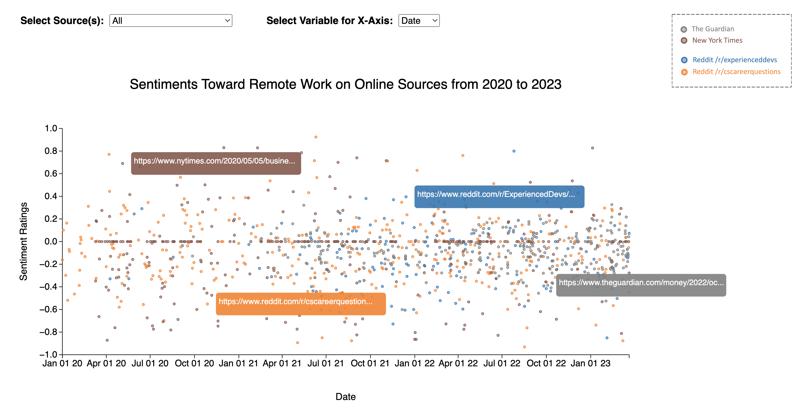

The interactive visualization is live at https://johnnyboustany.github.io/remotersdataviz/.

# Instructions:

The visualization consists of a figure displaying "Sentiments Toward Remote Work on Online Sources from 2020 to 2023."
The y-axis remains fixed as it shows the sentiment ratings, which range from -1 (negative) to 0 (neutral) to 1 (positive).

There are two ways that you can manipulate the parameters in the graph.

1. Change the online source(s) being displayed. You can either display all the sources on the graph or just one source at a time.

2. Change the variable for the x-axis: It can either be Date, to show the sentiment ratings over time, or it can be based on Source, to show how the sentiment ratings are distributed for each source.

You can also hover on the data points, which prompts a pop-up to appear near the point, displaying the article/post link. If you click on the data point, then the pop-up near the point will stay, unless you click on it again.

The image above shows a preview of the interactive visualization.
